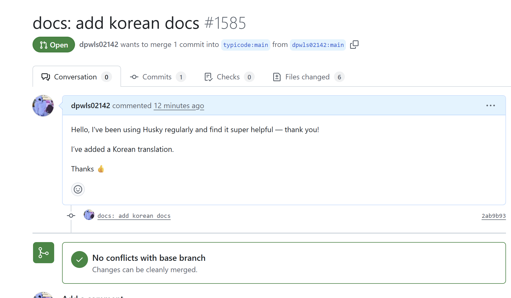

---
# Header
layout: post
title: "오픈소스에 PR 날려보기"
date: "2025-05-16"
categories:
  - "OSSCA"
tags: 
  - "2025"
  - "OSSCA"
image: "/assets/img/thumbnail/openhusky.jpg"
toc: true
toc_sticky: true
---

OSCCA에 참여하며
오늘 husky 오픈소스에 첫 PR을 날려봤습니다.

지금 참여하고 있는 과정의 명색이 오픈소스 컨트리뷰션인데.. 

오픈소스에 컨트리뷰트를 해봐야하지 않겠습니까
!!!!

아 참고로 [husky](https://typicode.github.io/husky/)란 커밋 메세지를 검사해주는 도구입니다.

쨌든, 그래서 지금 진행하고 있는 팀프로젝트에서 husky를 사용하는데
아직 공식문서에 한국어가 없더군요

~~(보통 다 있던데...)~~

이런 절호의 기회를 어케 참죠?

어제 새벽부터 오늘 아침까지 번역해서

재빠르게 PR을 날려봤습니다 후훗

너무 떨리네요

실수한건 없을지.. ㅋㅋ

노래 가사만 번역하다가 공식 문서는 처음 번역해봤는데 재밌군요

음음

언젠가 머지가 돼서 한국의 누군가가 허스키를 사용할 때 제 번역본을 보고 도움이 됐음 하네요

{:width="200"}