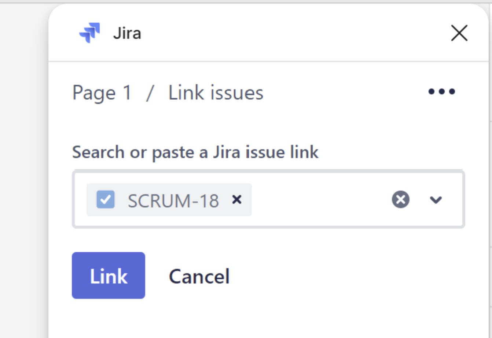
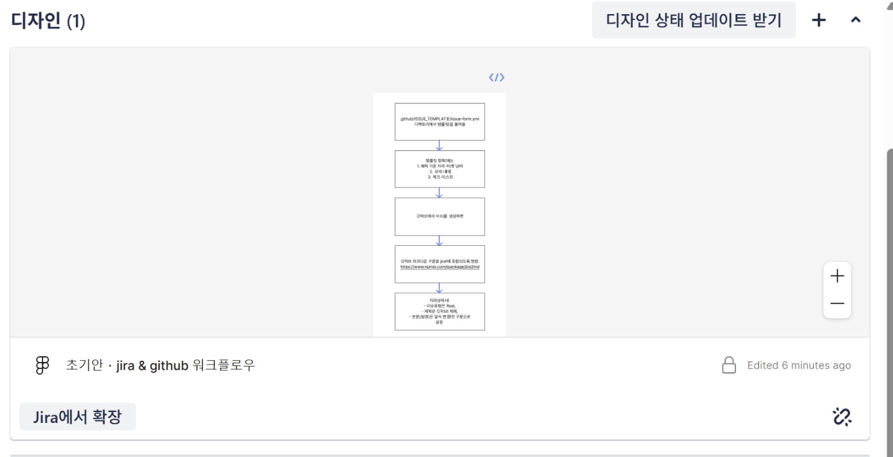
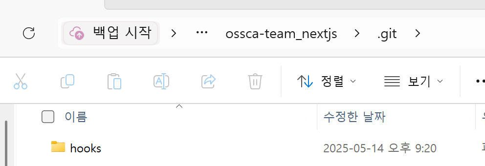

---
# Header
layout: post
title: "2025 OSSCA 체험형 Next.js 4주차 요일별 회고록"
date: "2025-05-22"
categories:
  - OSSCA
tags: 
  - "2025"
  - "OSSCA"
image: "/assets/img/thumbnail/next_4.jpg"
toc: true
toc_sticky: true
---

## 0510
[OSI 7계층, 네트워크 기초 공부](https://dpwls02142.github.io/posts/%EC%9D%B8%ED%84%B0%EB%84%B7%EC%97%90-%EC%A0%91%EC%86%8D%ED%95%98%EB%A9%B4-%EB%B2%8C%EC%96%B4%EC%A7%80%EB%8A%94-%EC%9D%BC/)

## 0513

### Jira & Github 연동
- [관련 이슈](https://github.com/2025-contribution-nextjs-team5/ossca-team_nextjs/issues/2)

- 용어 정리
    - **백로그란**
	    - 현재 진행 중인 작업과 앞으로 해야할 작업 목록 (아직 완료되지 않은 작업 항목들)
    - **스프린트란**
	    - 프로젝트를 작은 주기로 분할하여 모든 팀원이 정해진 기간동안 정해진 태스크를 몰두해서 작업하는 것.
    - **에픽? 스토리? 태스크?**
	    - **에픽:** 큰 기능의 작업
	       - 생각해보니 옛날에 1차 멘토링 브랜치 충돌 내기 실습을 했을 때 멘토님께서 epic 단위로 브랜치를 생성하신게 기억남. 
	       - 이 때도 에픽을 뜻을 찾아봤었는데 까먹고 있었음.. 
	       - "에픽"이라는 단어는 원래 광범위한 이야기나 작품을 다룰 때 쓰인다고함. (마치 영화장르처럼) 
	       - 고로 소프트웨어 방법론에서도 이 단어의 본질적 의미를 그대로 차용한 것.
	    - **스토리:** 사용자 관점에서 구현해야 할 기능 단위. 에픽보다는 작고 태스크보다는 큰 단위.
	    - **태스크:** 가장 작은 작업 단위로, 실제 개발자가 수행할 구체적인 작업 항목.

### Jira & Figma 연동
##### 초기엔
- 그냥 피그마에 있는 프레임을 복사해서 지라상에 이미지를 붙여넣었음.
- 근데 이렇게 이미지 자체를 붙여넣으면 추후 디자인에 변동이 생겼을 때 수정사항을 즉각적으로 보지 못하는 문제가 발생함.

##### 해결방법
1. Jira에 github 앱을 추가한것처럼, 똑같이 지라내에 figma 앱을 추가함.
2. figma에는 jira 플러그인을 설치함.
3. figma 상에서 프레임이나 컴포넌트를 클릭 후 왼쪽 사진처럼 이슈를 링크 시키고 지라에 들어가보면 오른쪽 이미지처럼 지라상에서 피그마를 연동돼서 바로 볼 수 있음.
<table>
    <tr>
        <td></td>
        <td></td>
    </tr>
</table>

##### 참고사항
- 지라내에서 추가한 이슈가 바로 피그마상에 나타나지 않는 것 같음. 피그마를 한 번 껐다가 실행해야 동기화가 되는듯함.

## 0514

| 주제                     | 링크                                                                                   |
|------------------------|----------------------------------------------------------------------------------------|
| 코드 컨벤션 관련            | [관련 이슈](https://github.com/2025-contribution-nextjs-team5/ossca-team_nextjs/issues/15) |
| 디렉토리 관련 토의         | [관련 이슈](https://github.com/2025-contribution-nextjs-team5/ossca-team_nextjs/discussions/14) |
| 코드 들여쓰기 관련 스타일     | [관련 이슈](https://github.com/2025-contribution-nextjs-team5/ossca-team_nextjs/discussions/17) |
| 깃헙 라벨 예쁘게 만들기      | [관련 이슈](https://github.com/2025-contribution-nextjs-team5/ossca-team_nextjs/issues/19) |

## 0515

### 커밋 컨벤션 정하기
- [관련 이슈](https://github.com/2025-contribution-nextjs-team5/ossca-team_nextjs/issues/21)

## 0516
어제 커밋 컨벤션 때문에 husky를 설정하다가, 
원리가 궁금해져서 공식 문서를 봤는데 
아직 한글 번역본이 없길래 냉큼 번역해서 PR을 날렸다.
1. [관련 포스팅](https://dpwls02142.github.io/posts/%EC%98%A4%ED%94%88%EC%86%8C%EC%8A%A4%EC%97%90-PR-%EB%82%A0%EB%A0%A4%EB%B3%B4%EA%B8%B0/)
2. [관련 PR](https://github.com/typicode/husky/pull/1585)

##### 참고사항
- lint란
    - 코드 내 오류와 스타일 문제를 **사전에** 찾아내는 정적 분석 도구
    - 옷에 생기는 보풀을 영어로 lint라고 부르는데, 코드 안에 보풀을 찾아낸다는 의미로 lint라 명명했다고 한다.
    - eslint 툴의 이름도 여기서 온거다.
    - [참고자료](https://en.wikipedia.org/wiki/Lint_(software))

- git hook이란
    - git 실행 중 특정 시점에 특정 동작을 트리거하기 위해 `.git/hooks` 디렉터리에 배치할 수 있는 프로그램
    - 진짜 해당 디렉토리 안에 husky로 설정한 pre-commit 파일이 있다 신기
    
    - [참고자료](https://git-scm.com/docs/githooks)