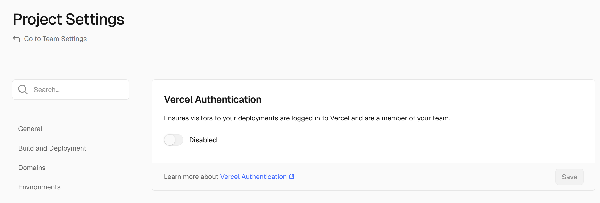

---
# Header
layout: post
title: "2025 OSSCA 체험형 Next.js 5주차 요일별 회고록"
date: "2025-05-22"
categories:
  - OSSCA
tags: 
  - "2025"
  - "OSSCA"
image: "/assets/img/thumbnail/next_5.jpg"
toc: true
toc_sticky: true
---

## 0517
### Header 컴포넌트 구현

- [관련 PR](https://github.com/2025-contribution-nextjs-team5/ossca-team_nextjs/pull/41)

## 0522

| 구분       | Layout                               | Template                            |
|------------|--------------------------------------|--------------------------------------|
| 리렌더링   | 안 됨                                | 됨                                   |
| 상태 유지  | 유지됨                               | 매번 초기화됨                        |
| 용도       | 네비게이션, 사이드바 같은 공통 UI   | 페이지별 독립 효과, 상태 분리 필요 시 |

- 무조건 최신 버전을 고집하면서 사용하는 것 보다 해당 버전에서 어떤 변경사항이 있었고 왜 필요한지를 따져가며 사용하기
- 서비스가 커질수록 기능이 비슷한 컴포넌트가 존재할 수 있으니 컴포넌트는 두 단어 이상으로 분리해서 제작하기
- 딕셔너리는 상위에 따로 빼서 관리하기, 변수명 고민하기

## 0523 ~ 0524
1. [jira github 워크플로 기능 추가](https://github.com/2025-contribution-nextjs-team5/ossca-team_nextjs/issues/57)

- github에서 티켓 넘버가 포함된 브랜치에 커밋이 발생할 시 gihub 이슈 라벨에 "작업중" 추가
- jira에서 해당 태스크 진행중 표시
- github에서 이슈를 완료 처리할 시 "작업중" 라벨 삭제
- jira에서 해당 태스크 완료 표시
- `atlassian/gajira-transition@v3`, `actions-cool/issues-helper@v3` 사용

2. [vecel 우회해서 배포하기](https://github.com/2025-contribution-nextjs-team5/ossca-team_nextjs/issues/51)

- 배경
    - 조직 레포를 Vercel과 직접 연결하면 요금이 발생함.
    - 이를 피하기 위해, 조직 레포의 stage와 main 브랜치만 개인 레포로 fork 하여 Vercel에서 배포하도록 워크플로를 구성함.

- 워크플로
    - 조직 레포의 빌드 결과물(output 폴더)을 개인 레포에 복사.
    - 개인 레포에는 stage와 main 브랜치만 존재.
    - 커밋이 발생하면 브랜치에 따라 다음과 같이 처리됨:
    - stage 브랜치: Preview 링크 생성 → PR 댓글에 자동으로 링크 추가.
    - main 브랜치: Production 링크 생성.

cf.) preview 관련 참고 사항
- Vercel은 기본적으로 main 외의 브랜치에 푸시되면 자동으로 Preview 링크를 생성함.
- Preview 브랜치를 별도로 지정할 수 있지만, 이 기능은 유료 플랜에서만 제공됨.
    - 따라서 모든 브랜치를 fork하면 커밋마다 Preview 링크가 계속 생성되어 관리가 어렵기에 stage와 main 브랜치만 가져옴. 

- 초기 설정에서는 Preview 링크에 접근 권한이 제한되는 문제가 발생함.
- 이를 해결하려면 Vercel 프로젝트 설정에서 Deployment Protection 탭 → Vercel Authentication 옵션을 끄면됨.

