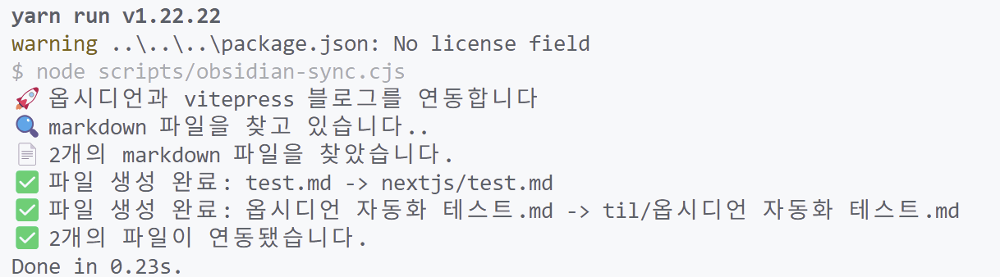
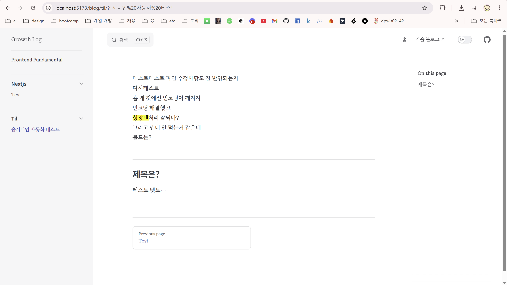

---
# Header
layout: post
title: "옵시디언과 Vitepress 블로그 연동하기"
date: "2025-06-02"
categories:
  - ETC
tags: 
  - "2025"
image: "/assets/img/thumbnail/vitepress.jpg"
toc: true
toc_sticky: true
---

안녕하세요

앞으로 TIL과 잡다한 공부 기록은 [이 곳](https://growth-log-kappa.vercel.app/)에 적으려 합니다.

나눈 이유는, 그냥 이 곳에는 개발 관련 포스팅만 적기로 했습니다.

공부 내용이랑 분리하는게 좋을 것 같아서요.

블로그 템플릿은 vitepress를 사용했습니다.
템플릿이 깔끔하고 공부 문서를 관리하는데 이만한게 없어보였습니다.

배포는 Vercel을 활용했고요. 

node 패키지 설치는 yarn을 사용했습니다.
앞으로 뭐할때는 yarn 써야겠습니다.
npm 보다 체감 백배는 빠른 것 같네요.

왜 빠른건지는 TIL로 적어보죠.

아래는 블로그를 설정하며 있던 일들 입니다.

## 옵시디언과 vitepress 자동화

vs code에서 md 형식으로 바로 글을 적는 것도 좋지만,
옵시디언에서 뭔갈 적는게 더 익숙해졌습니다.

그래서 로컬의 옵시디언 경로에 있는 파일을 불러와서
vitepress의 blog 디렉토리에 하위 항목으로 해당 파일들을 복사하고 싶었습니다.

자동화 전체 코드는 [다음](https://github.com/dpwls02142/growth-log/blob/main/scripts/obsidian-sync.cjs)과 같습니다.

그럼 코드를 하나씩 뽀개볼까요?

#### 라이브러리 불러오기
```js
const fs = require('fs');
const path = require('path');
const matter = require('gray-matter');
const glob = require('glob');
require('dotenv').config();
```
Node.js에서 모듈을 불러올 때는 require()를 사용하는데, 이건 기본적으로 동기적으로 작동합니다. <br/> 굳이 비동기로 모듈을 로드할 필요는 없으니까 그냥 일반적인 방식으로 불러왔어요. <br/>
동기와 비동기가 은근 갑자기 헷갈릴 때가 있는데요. 솔직히 어감만 보면 비동기가 순차적으로 이뤄지는 거고 동기가 동시에 이뤄지는 것처럼 느껴집니다. (저만 그런 거일 수도) <br/>
쨌든, 비동기라는 건 병렬 동작한다는 거고 동기라는 건 순차적으로 동작한다는 겁니다.
동기라는 뜻이 뭘까 생각해보면,

- 동기(Synchronous): syn(함께) + chronos(시간) → 시간을 맞춰서 순차적으로 실행
- 비동기(Asynchronous): a(부정) + synchronous → 시간을 안 맞추고 동시에 여러 작업을 처리

입니다.

사용한 패키지는 다음과 같습니다.

##### gray-metter
마크다운 파일의 **front matter(메타데이터)**를 파싱하기 위해 사용했습니다.

```yaml
---
title: 블로그 제목
date: 2024-01-01
category: frontend
---
```
요렇게 마크다운의 상위에서 `---`로 감싸진 메타데이터 부분을 추출하고 파싱해주는 역할입니다.

##### glob
추가/수정 된 파일을 불러오기 위해 사용했습니다.

##### env
환경 변수 설정을 위해 사용했습니다.
뭐, 그냥 보여줘도 상관 없지만...... 그냥 제 윈도우 이름을 가리고 싶었다 랄까? ㅋㅋㅋ

#### 경로 설정
```js
// 옵시디언 볼트 경로 설정
const OBSIDIAN_VAULT_PATH = process.env.OBSIDIAN_VAULT_PATH;
const BLOG_PATH = path.join(__dirname, '..', 'blog');

console.log('🚀 옵시디언과 vitepress 블로그를 연동합니다');

// 경로 확인
if (!OBSIDIAN_VAULT_PATH || !fs.existsSync(OBSIDIAN_VAULT_PATH)) {
    process.exit(1);
}

function getCategoryFromPath(filePath) {
    // 옵시디언 볼트 경로를 제외한 상대 경로 구하기
    const relativePath = path.relative(OBSIDIAN_VAULT_PATH, filePath);
    // 첫 번째 폴더를 카테고리로 사용
    const firstFolder = relativePath.split(path.sep)[0];
    return firstFolder || 'uncategorized';
}
```
옵시디언에서 볼트란, 모든 노트 파일이 저장되는 최상위 디렉토리를 의미합니다.
제가 desktop에 public-study 라는 폴더를 만들고,
옵시디언에서 이를 불러오면 public-study라는 폴더가 최상위 디렉토리가 되는겁니다.

`getCategoryFromPath` 함수는, 파일이 들어있는 첫번째 폴더명이 그 파일의 카테고리가 됩니다.
디렉토리가 아래와 같이 있다면, 

```
public-study/
├── frontend-fundamentals/
│   └── temp.md
├── next.js/
│   └── temp.md
└── til/
    └── temp.md
```

frontend-fundamentals과 next.js, til이 카테고리가 됩니다.


#### 옵시디언 문법으로 변환하기
```js
function convertObsidianToVitePress(content) {
    let convertedContent = content;

    // 1. 형광펜 ==텍스트== -> <mark>텍스트</mark>
    convertedContent = convertedContent.replace(/==(.*?)==/g, '<mark>$1</mark>');

    // 2. 줄바꿈 처리 개선 - 옵시디언은 단일 줄바꿈도 처리하는데 일반 마크다운은 2개 필요
    // 단락 구분을 명확히 하기 위해 빈 줄이 없는 줄바꿈에 <br> 추가
    convertedContent = convertedContent.replace(/([^\n])\n([^\n])/g, '$1  \n$2');

    // 3. 옵시디언 링크 [[링크]] -> [링크](링크.md)
    convertedContent = convertedContent.replace(/\[\[(.*?)\]\]/g, '[$1]($1.md)');


    return convertedContent;
}
```

`convertObsidianToVitePress` 함수는 옵시디언 문법을 vitepress 마크다운 문법으로 변환해주기 위해 사용했습니다.


옵시디언의 형광펜 문법이나, 마크다운 파일에선 무조건 엔터를 두 번 쳐야지만 엔터로 인식되는데 그냥 한 번만 쳐도 엔터 문법으로 변환하고 싶어서 정규표현식으로 처리했어요.


생각해보니 태그를 처리하는 부분도 있으면 좋을 것 같습니다.

#### 메타데이터 처리하기
```js
function processMarkdownFile(filePath) {
    try {
        const content = fs.readFileSync(filePath, { encoding: 'utf8' });
        const { data, content: markdownContent } = matter(content);

        const convertedContent = convertObsidianToVitePress(markdownContent);

        // 카테고리 결정 (파일 경로의 첫 번째 폴더 사용)
        const category = getCategoryFromPath(filePath);
        const categoryPath = path.join(BLOG_PATH, category);

        // 파일명 생성
        const fileName = path.basename(filePath);
        const targetPath = path.join(categoryPath, fileName);

        // 메타데이터 추가
        const frontMatter = {
            title: data.title || path.parse(fileName).name, // 타이틀은 파일명과 동일하게
            date: data.date || new Date().toISOString().split('T')[0], // 날짜는 파일 생성 날짜
            category: category,
            ...data
        };

        // 새 파일 생성
        const newContent = matter.stringify(convertedContent, frontMatter);
        fs.writeFileSync(targetPath, newContent, { encoding: 'utf8' });

        console.log(`✅ 파일 생성 완료: ${fileName} -> ${category}/${fileName}`);
        return true;
    } catch (error) {
        console.error(`❌ 파일 생성 오류 ${filePath}:`, error.message);
        return false;
    }
}
```

앞에서도 말했지만, VitePress나 Jekyll로 만들어진 블로그의 마크다운을 보면 메타데이터가 상위에 위치해서 이걸로 데이터를 파싱해옵니다. <br/>

그래서 `processMarkdownFile` 함수는 이걸 자동으로 생성해주기 위한 함수입니다. <br/>

인코딩도 처리하고요.

#### 파일 찾고 처리하기
```js
// 모든 .md 파일 찾기
console.log('🔍 markdown 파일을 찾고 있습니다..');

const mdFiles = glob.sync('**/*.md', {
    cwd: OBSIDIAN_VAULT_PATH,
    ignore: [
        '**/.obsidian/**',
        '**/.trash/**',
        '**/node_modules/**'
    ]
});

console.log(`📄 ${mdFiles.length}개의 markdown 파일을 찾았습니다.`);

// 각 파일 처리
let processedCount = 0;
let errorCount = 0;

mdFiles.forEach(file => {
    const fullPath = path.join(OBSIDIAN_VAULT_PATH, file);
    if (processMarkdownFile(fullPath)) {
        processedCount++;
    } else {
        errorCount++;
    }
});
```
glob 패턴을 사용해서 옵시디언 볼트 안의 모든 마크다운 파일을 찾고, 하나씩 처리해주는 부분입니다. 

.obsidian 폴더나 휴지통 파일들은 제외하고 처리하도록 했어요.

물론, `.obsidan` 폴더만 제외해줘도 충분히 됩니다.


#### 로그 출력하기

정상적으로 파일이 옮겨지면 아래와 같이 로그가 출력됩니다.



실험? 동작? 화면은 아래와 같습니다.



볼드처리는 사용하는 폰트에 따로 weight가 없어서

아래처럼 css 파일에 강제로 텍스트 shadow를 넣어서 처리해줬습니다.
```
    text-shadow: 0 0 0.6px 'black';
```    

근데 픽셀이 깨져보인다는 단점이 있어서 폰트를 바꿀지.... 고민 중입니다.

~~근데 이 폰트 예뿐데!!~~

그리고 적다보니 생각난건데, 이미지 경로 처리 로직도 있으면 좋을 것 같습니다.


벌써 6월인데, 6월도.. 열심히 코딩해보겠습니다 하하 ^^


그럼 안녕히계세요

{:width="200"}