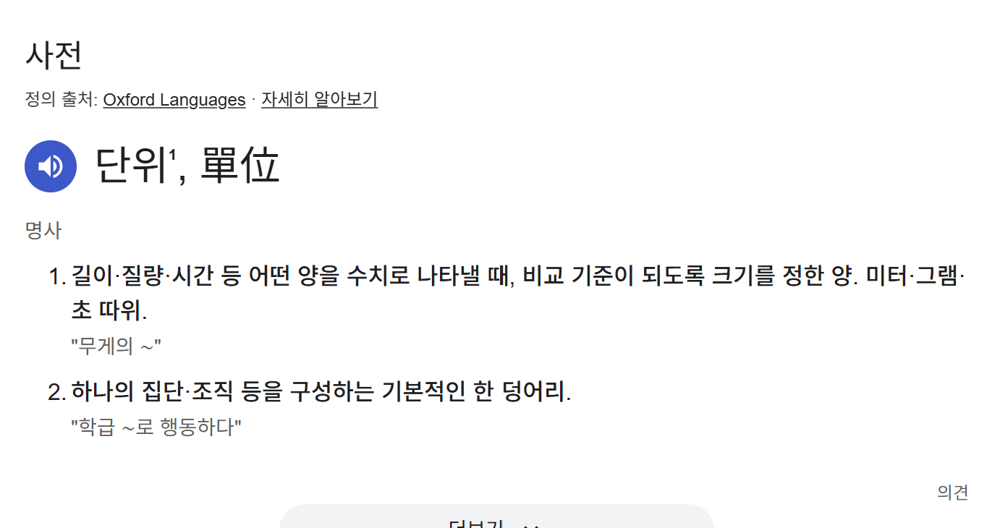

---
# Header
layout: post
title: "어디까지 테스트 해봤니"
date: "2025-06-29"
categories:
  - Front
tags: 
  - "2025"
image: "/assets/img/thumbnail/testing.jpg"
toc: true
toc_sticky: true
---

프론트엔드 개발을 하면 수많은 용어를 마주칩니다.  
물론 다른 분야도 마찬가지지만, 프론트엔드는 유.독. 많이 마주칩니다.

> 컴포넌트 테스트 자동화 필요하니까 리액트 테스팅 라이브러리 도입해주세요~

{:width="250"}

처음 들으면 네..? 하고 싶지 않아도 네? 가 자동으로 나옵니다.

수업 시간엔 알려주지 않는,
리액트 테스팅 라이브러리의 필요성에 대해 알아보려 합니다.

## 테스팅
그 전에 테스트란 뭘까요.
말 그대로 내가 만든게 잘 되는지 "검증" 하는겁니다.

난 개발할 때 테스트 안 해~ 하시는 분들은 아마 없을 겁니다..

함수 짜서 잘 작동하는지 로그 한 번 찍어보는 것도 테스트의 일종에 속하기 때문입니다.

이러한 테스팅에도 다양한 범위가 있고 그 범위마다 테스트 할 수 있는 라이브러리가 있습니다.

저는 여태껏 프론트에서 뭐 컴포넌트나 기능 하나를 개발한 후에
잘 되는지 안 되는지 테스트 하려면
손수 하나하나 눌러가보고 타이핑해보고
콘솔로그를 찍어가며 테스트 했습니다.

근데 요즘 사람들은 안 이런다네요? 저만 원시인이었던겁니다.

그럼 테스팅의 종류엔 뭐가 있을까요?

### 정적(static) 테스트
가장 먼저 정적 테스트가 있습니다.
TS의 타입 검사나, eslint로 코드 컨벤션을 검사하는게
정적 테스트입니다.

왜, 빌드나 런하기 전에 코드 문법 자체를 "검사"해보는 과정이잖아요?
그니까 이것도 테스트인겁니다.

근데 이제 코드 자체만 검사하는거니까. 정적이니까. 정적 테스트라고 하는겁니다.

이 때 ESLint와 같은 정적 테스트가 언제, 어떻게 이뤄지냐? 하면

저희가 작성한 코드는 컴파일 될 때 파싱이 됩니다.

파싱을 할 때 AST 라는 트리가 만들어지는데요.

이 트리를 보고 이제 정적 코드를 lint에 맞게 썼는지 검사하는겁니다.

그래서 빌드하기 전에 정적으로 테스트할 수 있는거고요.

### 단위(Unit) 테스트
다음으론 단위 테스트가 있습니다.
보통 뭘 보고 단위라고 부르죠?

{:width="250"}

네, 한 덩어리를 보고 단위라고 합니다.

그럼 코드에서 한 덩어리는 뭐가 있을까요?
겁나 많습니다.
메서드도 덩어리고요 클래스도 덩어리고요 함수도 덩어리입니다
그외에것도 다 덩어리입니다.

자기가 덩어리라고 느끼면 다 덩어리입니다. 컴포넌트도 덩어리고요.

그래서 이걸 테스트 하는걸 단위 테스트라 하고, 테스트의 가장 기본이 되는겁니다.

이 때 주로 사용되는 라이브러리가 ["Jest"](https://jestjs.io/) 라는 라이브러리인데요. jest에서 주로 사용되는 메서드는 다음과 같습니다.

어떤 함수를 테스트 할 때 jest에선 `test()`라는 메서드를 사용합니다. 근데 테스트만 해서 되겠습니까? 값도 전송해서 잘 되는지도 봐봐야하지 않겠습니까. 이렇게 값을 검증할 때는 `expect` 메서드를 사용합니다. 그리고 `mock`과 `spyOn` 메서드를 사용해서 외부 의존성을 가짜로 만들어 독립적인 테스트를 가능하게 합니다.

이 때 외부 의존성이란, 내가 테스트하려는 코드가 의존하는 다른 것들을 말합니다.
예를 들면 API 호출, 데이터베이스 연결, 다른 모듈의 함수 등이 있습니다.
이런 것들을 mock으로 대체하여 테스트하려는 코드만 독립적으로 검증할 수 있습니다.

### 통합(Integration) 테스트
아~ 근데 나는 API랑 연동해서 테스트해보고 싶은데? 하시는 분들 계시죠?
그런 분들이 통합 테스트 하시면 되는겁니다.

단위 테스트는 API 테스트 따로, 함수 테스트 따로, UI 테스트 따로 하는겁니다.
반면 통합 테스트는 API랑 함수 테스트 같이 묶어서 한 번에 하는겁니다.
애초에 단어도 통합이잖아요.

근데 나 테스팅 라이브러리 좀 들어봤다, 
하시는 분들은 여기서 드는 의문이 있을겁니다.

"그럼 [React Testing Library](https://testing-library.com/docs/react-testing-library/intro/)는 뭐지? Jest랑 뭔 차이지?"

Jest는 테스트 실행기입니다. 테스트를 돌리고 결과를 보여주는 엔진 같은거죠.
반면 React Testing Library는 React 컴포넌트를 테스트하기 위한 도구입니다.
사용자 관점에서 컴포넌트를 테스트할 수 있게 도와주는 라이브러리로,
DOM 요소를 선택하고 사용자 상호작용(클릭, 타이핑 등)을 시뮬레이션하여 
컴포넌트가 예상대로 동작하는지 검증합니다.

그래서 React Testing Library가 컴포넌트를 렌더링하고 DOM을 조작하면, Jest가 그 결과를 검증하는 식으로 사용됩니다.

그리고 또 헷갈리는 점이 있을 수 있어요. ~~저만 그런거일수도 있지만~~
Jest에서 사용되는 `mock`은 단위 테스트인가 통합 테스트인가? 라는 의문인데요.

정답은 

>"단위 테스트"에서 사용된다.

입니다.

통합 테스트는 "실제" 데이터를 갖고와서 테스트 하는거고요,
단위 테스트는 "가짜" 데이터로 하는겁니다.

아까 mock은 가짜 데이터로 테스트한다고 했죠? 그래서 mock을 사용하는건 단위 테스트에 해당합니다.

### E2E(End To End) 테스트
다음으로 E2E 테스트는
말 그대로 애플리케이션 흐름 처음부터 끝까지 모!!두!! 테스트하는걸 말합니다.

블로그 웹앱을 테스트 한다면 
회원가입부터 로그인, 글 작성, 수정, 삭제, 조회 등의 기능을 다 테스트하는거죠.

실제 사용자의 실행환경과 거의 동일한 환경에서 테스트를 진행하기 때문에 실제 상황에서 발생할 수 있는 에러를 사전에 발견할 수 있습니다.

이 때는 주로 [Cypress](https://www.cypress.io/)와 [Playwright](https://playwright.dev/) 라이브러리를 사용합니다.

Cypress는 테스트가 Queue 방식으로 실행돼서 테스트 할 개수가 많아지면 많아질 수록 시간도 오래걸립니다. 하지만 이렇게 큐로 처리되니까 실행 과정이 실시간으로 보여서 디버깅도 편하죠.

반면에 Playwright는 여러 테스트를 병렬로 동시에 돌릴 수 있습니다만, 사용하기엔 조금 더 어렵다고 합니다.

## 근데...
근데 적으면서 문득 든 생각이 있습니다. 
아니 근데 그러면 QA는 뭐하는거지? QA 직종이 테스트 하는 직업 아닌가..?

맞습니다. QA 분들도 테스트를 하죠. 하지만 개발자가 하는 테스트와 QA가 하는 테스트는 목적이 좀 다릅니다.

- 개발자 테스트 (우리가 지금까지 말한 것들)
  - 코드가 의도한대로 동작하는지 확인
  - 리팩토링 후에도 기능이 깨지지 않았는지 확인
  - 자동화로 빠른 피드백 받기

- QA 테스트
  - 사용자 관점에서 전체적인 품질 확인
  - 예상치 못한 엣지 케이스 발견
  - 사용성(UX) 관점에서의 문제점 찾기
  - 요구사항 만족 여부 확인

정리하자면 개발자는 기술적 안정성을, QA는 사용자 경험과 품질을 책임지는겁니다.

## 번외 (디버깅은 테스트일까?)
글의 앞부분에서 '테스트를 안 해본 개발자는 없을 것이다'를 말할 때
디버깅으로 예시를 들려고 했는데,
디버깅은 테스트에 속하는걸까? 그 기준이 애매해 해당 내용은 삭제했다.

테스트는 미리 정해진 기준으로 코드가 정상 작동하는지 보는거고,
디버깅은 이미 문제가 생긴 후에 원인을 찾는 과정이다.

솔직히 디버깅 과정에서도 이 값이 맞나 확인하고 콘솔 찍어서 검증하기 때문에
테스트가 아니라고 보긴 어려워 이 둘의 명확한 경계는 없는 것 같다.

넓은 의미에서 보면 디버깅도 테스트의 일종인거고, 좁은 의미에선 아닌 것 같다.

## 참고자료
- [[인턴일지] 프론트엔드 개발에서 테스트가 필요한가요?](https://velog.io/@osohyun0224/%ED%94%84%EB%A1%A0%ED%8A%B8%EC%97%94%EB%93%9C-%EA%B0%9C%EB%B0%9C%EC%97%90%EC%84%9C-%ED%85%8C%EC%8A%A4%ED%8A%B8%EA%B0%80-%ED%95%84%EC%9A%94%ED%95%9C%EA%B0%80%EC%9A%94)
- [테스트를 처음 공부하는 프론트엔드 개발자의 개념 다지기](https://velog.io/@leehyunho2001/%ED%85%8C%EC%8A%A4%ED%8A%B8%EB%A5%BC-%EC%B2%98%EC%9D%8C-%EA%B3%B5%EB%B6%80%ED%95%98%EB%8A%94-%ED%94%84%EB%A1%A0%ED%8A%B8%EC%97%94%EB%93%9C-%EA%B0%9C%EB%B0%9C%EC%9E%90%EC%9D%98-%EA%B0%9C%EB%85%90-%EB%8B%A4%EC%A7%80%EA%B8%B0)
- [How does Jest work inside?](https://medium.com/dailyjs/how-does-jest-work-929d0de0fa03)
- [Difference between Testing and Debugging](https://www.browserstack.com/guide/difference-between-testing-and-debugging)