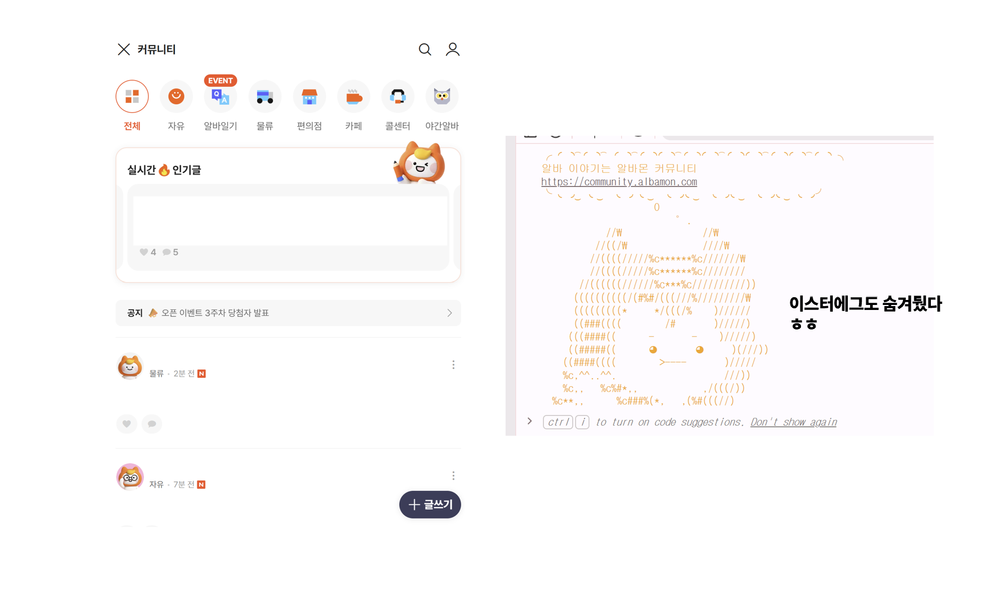
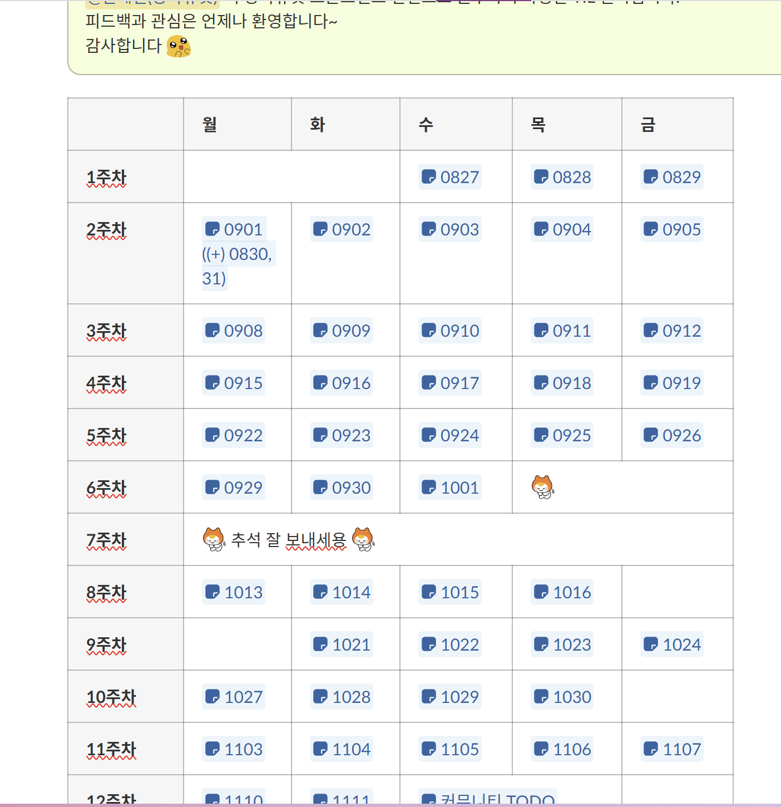
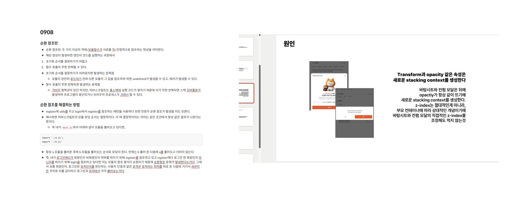

---
# Header
layout: post
title: "인생 첫 사회생활 후기 (feat.알바몬)"
date: "2025-12-04"
categories:
  - Front
tags: 
  - "2025"
image: "/assets/img/thumbnail/albamon.jpg"
toc: true
toc_sticky: true
---

약 4개월 만에 포스팅을 하게 됐는데, 그 이유는 4개월간 내 인생 첫 사회생활을 했기 때문이다.

내가 근무한 회사는 채용 플랫폼 서비스를 제공하는 [잡코리아](https://jobkoreacareer.oopy.io/)로, 교대역에 내릴 때면 홍보음도 나오는 우리나라의 대표 채용 플랫폼 서비스다. (사실 모르는 사람이 거의 없지 않을까 싶다 ㅎ) 지원 계기는 나 또한 잡코리아와 알바몬 서비스를 예전부터 자연스럽게 사용해 왔기에, 어떤 방식으로 서비스가 만들어지고 운영되는지 직접 경험해 보고 싶다는 마음이었다.

[미래내일일경험](https://yw.work24.go.kr/main.do)의 일환으로 근무했으며, 채용 프로세스는 서류 → 면접으로 진행되었고, 면접은 같이 일하게 될 FE 팀원분들이 직접 진행해 주셨다. 감사하게도 합격하여 4개월간 출근했고, 근무 기간의 막바지에 도달한 지금, 그동안 느꼈던 점을 정리해 보려 한다.

내가 속한 조직은 양파유닛이라는 팀인데, 현재 잡코리아가 추구하는 RE:STARTUP 방향성에 가장 부합하는 팀이라고 느꼈다.
빠르게 실험하고, 데이터를 근거로 의사결정하며, 짧은 주기로 배포와 피드백이 반복되는 흐름 속에서 일하는 것은 인턴인 나에게 큰 자극이 되었다. 스타트업처럼 빠르고 유연하게 움직이지만, 동시에 안정적인 프로세스를 기반으로 성장하고 있다는 느낌을 받았다. ((무엇보다 같이 일하는 팀원분들이 다 너무 좋으셨다.))

이번 근무 기간 동안 내가 집중해서 진행한 업무는 [알바몬 커뮤니티](https://community.albamon.com/) FE 개발이었다.

{:width="650"}

알바몬은 본질적으로 구인·구직 플랫폼이기 때문에, 사용자는 원하는 일자리를 찾으면 자연스럽게 앱을 이탈하는 경향이 있다. 커뮤니티 서비스는 이런 이탈을 줄이고, 사용자가 다른 목적으로 더 오래 머무를 수 있도록 만드는 중요한 시도라고 생각했다.
기존에 알바토크 서비스가 있었지만 크게 활성화되어 있지 않았기에, 직관적인 네이밍과 개편을 통해 사용자의 체류율을 높이는 것이 목표였다.

처음 입사했을 땐 프로필 페이지만 담당했었는데, 검색, 헤더, 무한 스크롤 등 다양한 기능을 개발하게 되었다. 사실 아직도 신기하다. 내가 작성한 코드로 돌아가는 서비스가 실제 사용자에게 제공되고 있다니.

개발 과정의 기술적 측면에선 무한/가상 스크롤 부분에 애를 많이 먹었다. ((다른 것도 많지만.. 가장 기억에 남는건 이 부분이다 ㅎ)) 
커뮤니티 프로젝트에서 게시글의 높이는 정말 동적으로 많이 변한다. (이미지도 있고, 더보기 버튼으로 글의 높이를 확장할 수 있기 때문이다.) 
사실 지금도 완벽하지 않다. 다양한 사람들이 이용하는 서비스다 보니 정말 내 컴에서만 잘 돌아가는게 목표가 아니지 않는가. 그래서 크로스 브라우징 환경에서 동작을 체크하는게 많았고, safari 환경에서 위로 스크롤 시 버벅임 현상이 심해서 measureElement 관련 파라미터에 아래 코드를 추가해 사용하고 있다. 

[https://github.com/TanStack/virtual/issues/659](https://github.com/TanStack/virtual/issues/659)

근데 가만 생각해보니 tanstack virtual 라이브러리의 코어 부분 자체를 수정하는게 좋을 것 같다 생각해 차주 FE 스크럼 전까지 tanstack virtual 레포에 PR을 올려보는 것이 목표다.

아무래도 처음에는 마냥 기획에 맞춘 기능을 개발해야 된다는 관점에서 접근했지만, 점차 사용자가 편안하게 콘텐츠를 소비하고 더 오래 머물게 하려면 어떻게 해야될까라는 관점으로 사고가 전환되며 발생하는 이슈들을 바라볼 때 단순한 기술적 문제가 아니라 사용자 경험을 해치는 장애물로 바라보게 되었던 것 같다.

다음은 내가 근무하며 스스로 느낀 잘한 점과 아쉬운 점이다.

**잘한 점:**
- AI를 활용해 기존 코드를 빠르게 학습하려고 노력했고, 매일 TIL을 작성하며 학습의 흐름을 잃지 않으려고 했다.

{:width="250"}

- 매주 FE 스크럼 때마다 학습한 내용을 팀원분들께 발표했는데, 항상 좋은 질문과 관점을 많이 던져주셔서 감사했다.

아래는 실제로 내가 발표 때 사용했던 자료 중 일부다.

그중 테스트 코드 관련 자료는 사내에서 활용하려 했지만 여러 이유로 무산되어 아쉬움에 여기에라도 남겨본다 ((회색 박스는 내부 내용과 관련되어 있다 판단하여 가렸다))
<iframe src="https://drive.google.com/file/d/1xNSdCPH2VjjBgduLfbf1KUBC0dgkpAUr/preview" 
        width="100%" 
        height="350px" 
        allow="autoplay">
</iframe>

**아쉬운 점:**
- 구현 속도에 집중하다 보니 스스로 개발한 내용을 충분히 정리하거나 기억하지 못한 순간이 있었다. (첫 배포 날 퇴근 후에도 잠이 안 와서 커뮤니티를 계속 확인했는데, 컨펌 헤더가 동작하지 않아 어쩔 줄을 몰라했는데, 알고 보니 빌드 이미지가 테스트용으로 올라가 있었던 해프닝이 있었다 ㅎ)
- 깊게 공부하려 노력하지만 금방 잊어버리는 성향이 있어 이를 극복해야 한다고 느꼈다.

#### 앞으로의 방향성

이번 인턴 경험을 통해 단순히 기능을 구현하는 개발자가 아니라, 사용자의 문제와 서비스의 목적을 이해하고 스스로 방향을 제안할 수 있는 개발자가 되어야 한다고 생각하게 됐다.

데이터를 근거로 개선 방향을 찾고, 사용자가 더 오래 머무르는 경험을 고민하며, 팀과 함께 목적 중심의 의사결정을 할 수 있는 사람이 되고 싶다.

기술을 활용하고 학습하는 능력도 중요하지만, 엔지니어는 결국 사용자에게 가치를 제공하는 사람이라고 생각한다. 그렇기에 항상 사용자 관점에서 문제를 바라보는 것이 가파르게 성장하는 AI 시대에서 살아남을 수 있는 개발자의 핵심 역량이 아닐까 싶다. (글을 적다 보니, GA 데이터를 활용해 커뮤니티 내 카테고리 탭의 정렬 순서를 바꿔보는 A/B 테스트를 진행하는 것도 좋겠다는 생각이 든다.)

또한 조직 내 협업과 목표 공유의 중요성도 깊이 느꼈다. 서비스는 혼자만의 힘으로 만들어지는 것이 아니기에, 서비스 운영에 참여하는 모든 구성원이 같은 목적을 가지고 일할 때 그 시너지가 사용자에게도 자연스럽게 전달된다고 믿는다. 예를 들자면 "알바몬 커뮤니티를 통해 구인·구직자들에게 삶의 소소한 희망을 준다"는 공통된 목표 아래 움직일 때, 사용자 또한 이를 느끼게 되고 모두에게 의미 있는 서비스가 되지 않을까 싶다.

첫 사회생활을 이런 팀에서 시작할 수 있었다는 것 자체로 큰 행운이라고 생각한다. 앞으로도 더 빠르게 성장하고, 내가 가진 기술과 시각을 서비스에 실질적으로 기여할 수 있는 개발자가 되고 싶다.

4개월 간 부족한 저를 이끌어주신 팀원분들께 너무 감사드리고, 남은 기간도 최선을 다해 의미있게 마무리하고 가고 싶다.