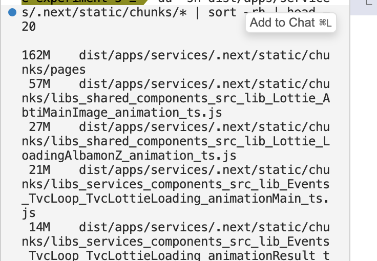

---
# Header
layout: post
title: "왤케 메모리가 터질까?"
date: "2026-04-21"
categories:
  - Front
tags: 
  - "2026"
toc: true
toc_sticky: true
---

26년 첫 포스팅 && 첫 커밋이라니 거짓말 같군.. <br>
근데 회사 커밋은 매일 채웠어요 (진짜로)

모노레포 환경에서 next12를 사용하다 보면 메모리가 자주 죽는데요 ㅠㅠ

오늘은 이 메모리가 죽을 때 내뿜는 에러에 대해서 한 번 파악해볼까 합니다
물론 node options를 설정해서 (export NODE_OPTIONS="--max-old-space-size=8192") 힙을 늘릴 순 있지만.. 
노트북이 너무 뜨거워여!!!

그래서. 시간이 아주 쪼금 짬나는 이 틈에 과연 왜 터지는건지 로그를 한 번 분석해보겠습니다

```
<--- Last few GCs --->

[54364:0x9ff400000]   206110 ms: Scavenge (reduce) 4029.9 (4114.0) -> 4029.4 (4114.0) MB, 2.7 / 0.0 ms  (average mu = 0.756, current mu = 0.201) allocation failure; 
[54364:0x9ff400000]   206763 ms: Mark-sweep (reduce) 4088.8 (4172.5) -> 4072.2 (4156.8) MB, 466.3 / 0.0 ms  (+ 37.7 ms in 3 steps since start of marking, biggest step 37.7 ms, walltime since start of marking 511 ms) (average mu = 0.770, current mu = 0.778
```

- Scavenge는 V8의 Young Generation(New Space, 새로운 객체 영역) 을 청소하는 Minor GC예요.
- New Space는 내부적으로 From-space / To-space 두 개로 쪼개져 있는데 새로운 객체는 일단 From-space에 막 쌓이다가, 꽉 차는 순간 Scavenge가 발동된다고 해여

1. From-space에서 아직 참조되고 있는(살아있는) 객체만 골라서 To-space로 이동
2. From-space는 싹 비워버리기
3. From ↔ To 역할 교체

- 이 과정에서 두 번 살아남은 객체는 오래 쓰이는 애구나~ 판단해서 Old Space로 승격시켜여 그래서 New Space 자체는 1~8MB로 작기 때문에 자주, 빠르게 실행되는게 특징이에요
- Minor가 있으니 Major도 있겠져 그래서 Scavenge가 끝나고 발동한게 mark-sweep, Major GC에요
- Major GC도 세 단계로 진행된다고 합니다

1. Marking <br>
Root에서 출발해서 닿을 수 있는 객체는 마킹, 닿지 않는 애들은 그냥 놔둬요.
2. Sweep <br>
마킹 안 된 객체들 싹 제거하고, 빈 공간은 Free list에 등록해요.
3. Compact <br>
여기저기 파편화된 메모리를 압축해서 정리해여
근데 Major GC는 탐색 범위가 넓어서 Minor GC보다 훨씬 오래 걸려요 ㅠㅠ

- 그래서 로그가 저모양인겁니다
- 거기다 current mu = 0.201 이니까 전체 실행 시간의 80%를 GC가 잡아먹고 있는 상태...
- 이게 바로 GC 쓰래싱~ 사실상 GC만 하느라 아무것도 못 하는 상태인 거죠
- [조은 글](https://medium.com/hcleedev/web-javascript%EC%9D%98-garbage-collection-v8-%EC%97%94%EC%A7%84-9409c5be917c)

그럼 좀 더 자세히 stack trace를 봐볼까여? (너무 길어서 일부는 잘라냈어요)

```
<--- JS stacktrace --->

FATAL ERROR: Reached heap limit Allocation failed - JavaScript heap out of memory
11: 0x10512acac v8::internal::Handle<v8::internal::String> v8::internal::StringTable::LookupKey<v8::internal::SequentialStringKey<unsigned char>, v8::internal::Isolate>(v8::internal::Isolate*, v8::internal::SequentialStringKey<unsigned char>*) [/Users/yejin0824/.nvm/versions/node/v18.20.8/bin/node]
12: 0x104cd1c34 void v8::internal::AstValueFactory::Internalize<v8::internal::Isolate>(v8::internal::Isolate*) [/Users/yejin0824/.nvm/versions/node/v18.20.8/bin/node]
13: 0x10515060c v8::internal::Parser::DoParseProgram(v8::internal::Isolate*, v8::internal::ParseInfo*) [/Users/yejin0824/.nvm/versions/node/v18.20.8/bin/node]
14: 0x10514fde0 v8::internal::Parser::ParseProgram(v8::internal::Isolate*, v8::internal::Handle<v8::internal::Script>, v8::internal::ParseInfo*, v8::internal::MaybeHandle<v8::internal::ScopeInfo>) [/Users/yejin0824/.nvm/versions/node/v18.20.8/bin/node]
15: 0x105173e5c v8::internal::parsing::ParseProgram(v8::internal::ParseInfo*, v8::internal::Handle<v8::internal::Script>, v8::internal::MaybeHandle<v8::internal::ScopeInfo>, v8::internal::Isolate*, v8::internal::parsing::ReportStatisticsMode) [/Users/yejin0824/.nvm/versions/node/v18.20.8/bin/node]
------
42: 0x104a4cc84 node::InternalCallbackScope::Close() [/Users/yejin0824/.nvm/versions/node/v18.20.8/bin/node]
43: 0x104a4c874 node::InternalCallbackScope::~InternalCallbackScope() [/Users/yejin0824/.nvm/versions/node/v18.20.8/bin/node]
44: 0x104b1b0f4 node::fs::FileHandle::CloseReq::Resolve() [/Users/yejin0824/.nvm/versions/node/v18.20.8/bin/node]
45: 0x104b32208 node::fs::FileHandle::ClosePromise()::$_0::__invoke(uv_fs_s*) [/Users/yejin0824/.nvm/versions/node/v18.20.8/bin/node]
```

여기서 frame 12~14를 보면
```
12: 0x104cd1c34 void v8::internal::AstValueFactory::Internalize<v8::internal::Isolate>(v8::internal::Isolate*) [/Users/yejin0824/.nvm/versions/node/v18.20.8/bin/node]
13: 0x10515060c v8::internal::Parser::DoParseProgram(v8::internal::Isolate*, v8::internal::ParseInfo*) [/Users/yejin0824/.nvm/versions/node/v18.20.8/bin/node]
14: 0x10514fde0 v8::internal::Parser::ParseProgram(v8::internal::Isolate*, v8::internal::Handle<v8::internal::Script>, v8::internal::ParseInfo*, v8::internal::MaybeHandle<v8::internal::ScopeInfo>) [/Users/yejin0824/.nvm/versions/node/v18.20.8/bin/node]
```
v8이 js 파일을 파싱하는 중에 oom(out of memory)가 발생하고 있어여
그래서 dist에 저장되는 .next의 파일들 중 메모리 청크가 가장 높은 파일들을 발라내보면??

{:width="300"}

아닛... 다 lottie 파일들이 주를 이루고 있어염
왜이러지? 하고 보니까 lottie 확장자를 ts로 저장하고 있더라고요?
lottie를 json 파일로 두면 webpack이 얘를 건들지 않으니까 메모리에 lottie 관련한 게 상주하지 않을텐데..

근데 그렇다고 감히 제가 레포에 있는 모든 lottie 파일들을 직접 json으로 바꾸고 public 하위에 두게 만들어 버린다면?!!!
충돌이 엄청 날 수도 있으니까 다른 획기적인 방법은 없을까 했슴다

그렇게 고안한 방법은.. ts를 json으로 파싱하면 되는거니까 전처리 파일을 생성하고 이걸 webpack 빌드할 때 unshift 처리하면 되지 않을까?! 였어요
> 파싱 파일을 다른 것 보다 무조건 젤 먼저 처리하라는거쥬

```js
'use strict';

function convertToJson(source) {
  // 0. "export default { ... };" 에서 object literal 부분만 추출
  let content = source
    .replace(/^[\s\S]*?export default\s*/, '')
    .replace(/;?\s*$/, '')
    .trim();

  // 1. 따옴표 없는 키를 쌍따옴표로 감싸기
  //    { 또는 , 뒤에 쌍따옴표/홑따옴표 없이 바로 식별자가 오고 : 가 따라오면 키로 간주
  //    예: { nm: → { "nm":   ,  x: → "x":
  //    이미 "id": 처럼 따옴표로 감싸인 키는 '"' 가 식별자 문자가 아니므로 건드리지 않음
  content = content.replace(
    /([{,][\s\n\r]*)([a-zA-Z_$][a-zA-Z0-9_$]*)\s*:/g,
    '$1"$2":'
  );

  // 2. 쌍따옴표 문자열을 null byte 기반 placeholder로 치환해 보호
  //    null byte(\x00)를 구분자로 사용해 일반 텍스트와 충돌하지 않도록 함
  //    예: "var $bm_rt;\n$bm_rt = loopOut('cycle');" → \x00DQ0\x00
  const savedDoubleQuoted = [];
  content = content.replace(/"((?:[^"\\]|\\.)*)"/g, (match) => {
    savedDoubleQuoted.push(match);
    return `\x00DQ${savedDoubleQuoted.length - 1}\x00`;
  });

  // 3. 남은 홑따옴표 문자열 → 쌍따옴표 문자열
  //    이스케이프된 홑따옴표(\')는 홑따옴표로, 내부 쌍따옴표는 이스케이프 처리
  content = content.replace(/'((?:[^'\\]|\\.)*)'/g, (_, inner) => {
    const fixed = inner
      .replace(/\\'/g, "'")  // \' → '
      .replace(/"/g, '\\"'); // " → \"
    return `"${fixed}"`;
  });

  // 4. 보호했던 쌍따옴표 문자열 복원
  content = content.replace(/\x00DQ(\d+)\x00/g, (_, idx) => savedDoubleQuoted[parseInt(idx)]);

  // 5. trailing comma 제거: ,} ,]
  content = content.replace(/,(\s*[}\]])/g, '$1');

  return content;
}

module.exports = function lottieJsonLoader(source) {
  this.cacheable && this.cacheable();
  try {
    const json = convertToJson(source);
    JSON.parse(json);
    return `export default JSON.parse(${JSON.stringify(json)});`;
  } catch (err) {
    this.emitError(
      new Error(
        `[lottie-json-loader] "${this.resourcePath}" 변환 실패:\n${err.message}`
      )
    );
    return source;
  }
};

```

그리고 각 서비스의 next config webpack return문 위에 아래와 같이 추가했어요
```js
    config.module.rules.unshift({
      test: /[/\\]Lottie[/\\].*animation[^.]*\.ts$|[/\\]TvcLottieLoading[/\\]animation[^.]*\.ts$/,
      use: [require.resolve('../../tools/lottie-json-loader')],
      enforce: 'pre',
    });
```

이렇게 했더니 정말 페이지를 아무리 왔다리갔다리 하고 다른 기능을 사용해도 터지지가 않아여!!
근데 이걸 사용하려면 전수 qa도 돌아야 되고 할 것 같아서 흠흠 (아무래도 lottile 파일 자체를 건드는거기 때문에)
일단 블로그에 기록겸 남겨둡니다
(아니면 뭐 dev에만 돌게하고 fallback은 없애도 되겠네요)

저는 next 12 환경 때문에 메모리가 자주 터지는거라고 생각을 했는데요
(swc가 아닌 babel을 사용하고 있어서 node.js 힙 위에 돌다보니까)

근데 로그를 분석해보니 babel 문제는 아니였단걸 깨닫게 됐습니다~

아키텍처 설계가 정말 중요하겟네요
로티 파일은 json으로 씁시다~
그럼 안녕히......
